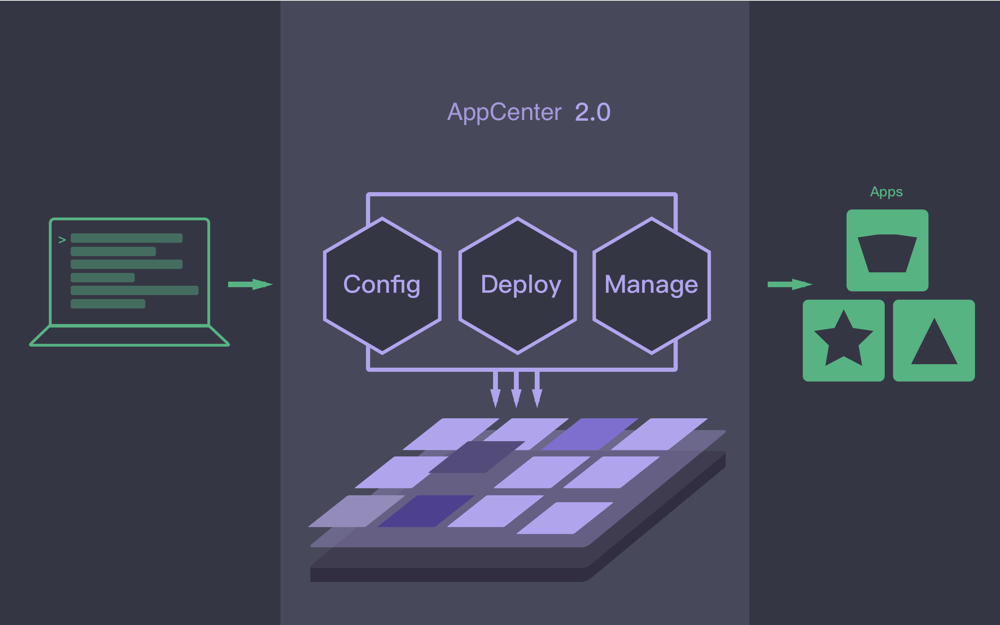

# 序言

我们都已看到，无论是公有云、私有云或混合云，还是 IaaS、PaaS、SaaS 或者近年来盛行的容器平台，越来越多的企业和个人已经在使用云上提供的各类丰富服务，云计算的常态化在全世界已成为不可逆转的趋势。那么对于提供 IT 产品和应用给最终用户的企业来说，把企业的产品和应用变成原生的云服务，将会是极具价值的一个战略举措。但是抛开商业交付模式上的转变，单从技术角度来说，产品和应用的云化一直是一个很有挑战的难题，因为这需要企业在设计和开发中深刻了解并能运用云计算的各种技术特性，比如弹性伸缩和在线扩容时的资源调度、各种配置的动态更新、服务间的发现及感知等等，云化的时间成本至少是“以月计算”。在这个市场需求瞬息万变的互联时代，这显然已成为企业将产品和服务快速交付给用户的一个巨大障碍，因此，建立一个学习使用成本低的高度标准化平台迫在眉睫，青云 QingCloud AppCenter 2.0 也就应运而生。有了这样的平台即云操作系统后，无论原有的产品和应用的架构是简单，还是复杂，如单主、Peer-to-Peer、一主一从、一主多从、多主多从、分片多主多从等等，也无论是新型的互联网应用还是传统的企业应用，都可以在“以天计算”的时间成本内完成产品和应用的云化，变成一个拥有所有云计算内置能力的新产品和应用。除此之外，平台上所有的产品和应用都可以以服务的形式和其它产品和应用一起灵活简洁的集成编排，形成更具价值的大服务，可以想像，这种以生态系统为形式的融合创造，将会为最终用户价值的创造提供无限广阔的可能。

## 读者对象

青云 AppCenter 2.0 旨在人人都能开发云应用，本指南将介绍如何在青云 QingCloud AppCenter 之上云化应用，因此凡是对如何在云平台之上开发应用感兴趣的个人和企业都能使用此指南，具体来说此平台对青云的合作伙伴及个人都开放，但个人用户不能发布应用到商店供公众使用。

## 如何阅读

如果想迅速了解如何开发基于 AppCenter 2.0 的应用，可以直接阅读 [快速入门](docs/quick-start/README.md)。如果想按部就班全面掌握开发云应用，请阅读 [应用管理](docs/app-mgmt/README.md) 和 [应用版本管理](docs/app-version-mgmt/README.md)，先仿照指南提供的比较简单的案例比如 ZooKeeer 或 Redis 部署一遍，了解整个流程之后您可以按照您应用的部署要求在 [应用模版规范-完整版](docs/specifications/specifications.md) 寻找相应解决方法以及从 [Metadata 服务](docs/metadata-service.md) 找到您需要的信息，在调试的时候最好参考一下 [调试指南](docs/debug.md)。

## 联系我们

* 技术疑问：周小四　ray@yunify.com
* 商务合作：田华　 tianhua@yunify.com

## 文档版本控制

* 版本号：{{ ""| gitTag}}
* hash id： {{"" | gitLong}}
* 项目地址：https://github.com/QingCloudAppcenter/developer-guide/