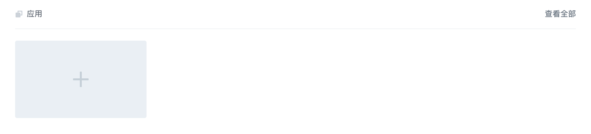
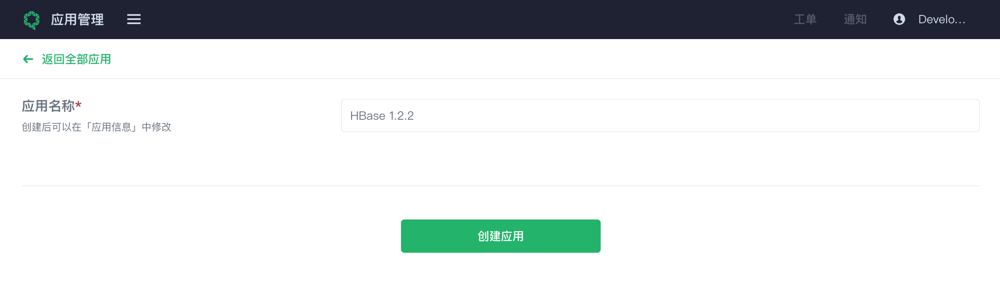
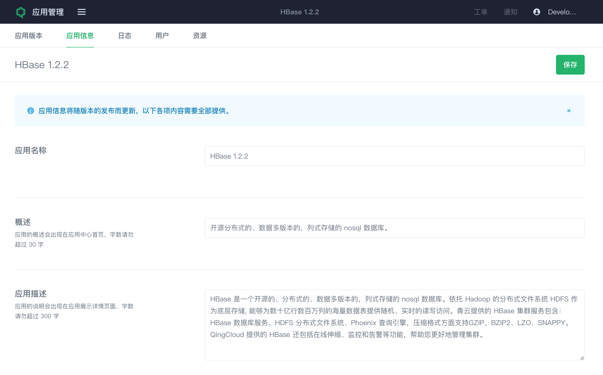
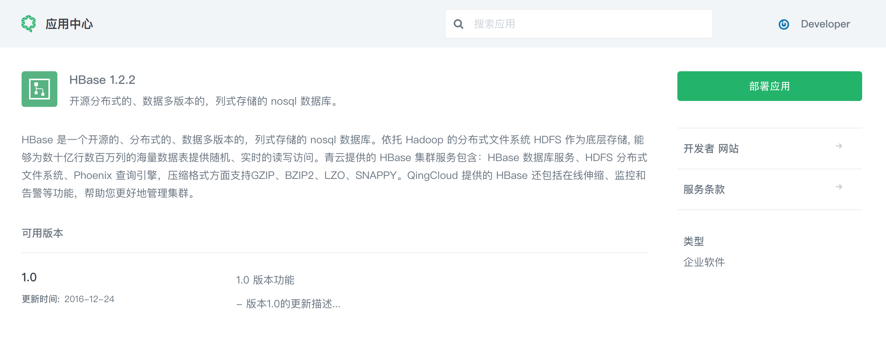

### 基本介绍
创建一个应用的基本流程：

* [创建一个应用](#创建应用)
* [创建该应用的第一个版本](../app-version-mgmt/create-app-version.md)
* [完善应用的详细信息](#应用信息)
* [提交应用版本审核](../app-version-mgmt/submit-app-version.md)或直接发布到个人应用中心(内部使用的应用)

### 创建应用
首先登录[应用管理平台](https://appcenter.qingcloud.com/developer)，点击“应用”部分的“+”号按钮，开始创建第一个应用。

进入创建页面之后，输入应用名称，例如：HBase 1.2.2。

点击“创建应用”按钮，您的第一个应用便创建成功，成功之后将直接进入[应用版本](../app-version-mgmt/create-app-version.md)中创建该应用的第一个版本，完善应用详细信息的步骤可暂时跳过。

### 应用信息

用户在浏览、搜索和查看应用时是通过基本信息来了解应用的各个方面的，主要包括以下几种信息：

+ **应用名称**: 为您的应用起一个简洁明了的名称，便于用户浏览和搜索；
+ **概述**: 简单介绍应用的主要功能及特性，让用户进一步了解该应用；
+ **应用描述**: 可在应用描述中详细介绍应用的各个功能以及特性，当用户想进一步了解应用时，描述内容的完整将变成尤为重要；
+ **应用类别**: 目前支持的应用类别主要有：基础服务、企业软件、研发管理、运维管理、安全管理和行业增值几大类，请根据应用的功能特性选择适合的应用类别；
+ **使用说明**: 用户如何使用本应用的详细说明，[语法说明](../faq/README.md#tos_and_usage_desc)；
+ **服务条款**: 若用户在使用应用过程中需要同意一些特殊条款请在此声明，用户在部署安装时我们会告知用户，[语法说明](../faq/README.md#tos_and_usage_desc)；
+ **应用图标**: 为您的应用设计一枚美观的图标，以代表您的应用并突出应用特点；
+ **应用截图**: 清晰的界面截图可以辅助以上信息帮助用户直观了解应用的各个方面。

完整、准确的应用信息可以让您的应用更容易被用户搜索到，在应用提交审核的时候以上信息也是管理员严格审核的内容之一。

需要强调的是：若对于已发布的应用需要更新其中部分内容，需要等下次版本发布成功后才可体现在应用中心中。

完善的 HBase 1.2.2 应用信息如下：

在应用中心中呈现给最终用户的效果如下：

