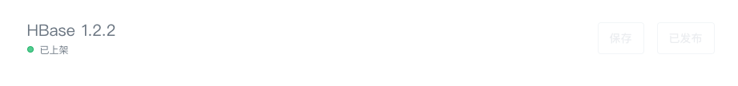

### 上架版本

审核通过之后，服务商可以根据自己的计划来选择时间上架此应用。应用一旦上架则意味着应用会出现在“应用中心”的应用列表中，用户可以随时浏览、购买并部署应用。且**上架的应用版本不允许再做任何修改**，如有问题需要修复或服务需要升级请按上面的步骤提交新版本，等待审核通过后可以上架新版本，再将旧版本下架或删除。

### 下架版本

下架需要工单联系青云管理员，提交下架申请并等待青云管理员审核，下架的应用版本因为还有用户在使用，所以对于这些用户提交的工单开发者依旧要给予及时的响应和服务。当所有版本都下架时该应用也会自动下架。
