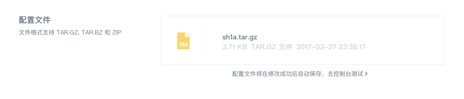
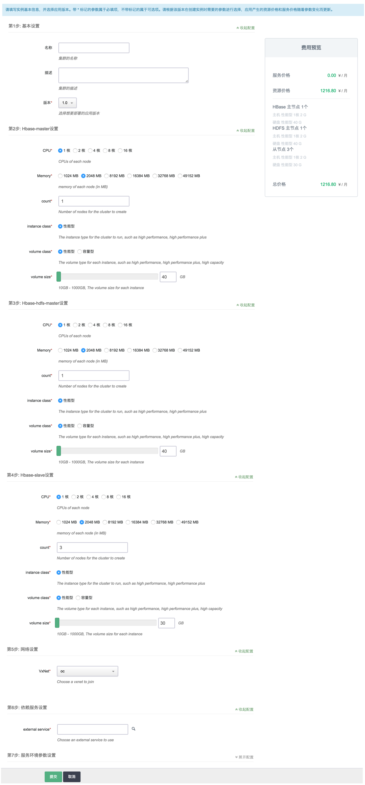
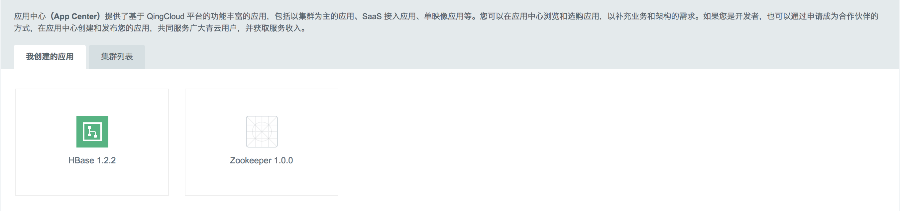
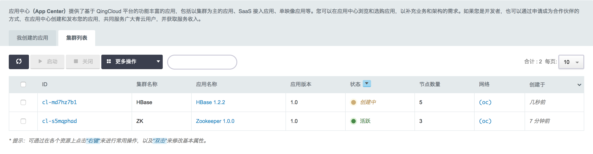
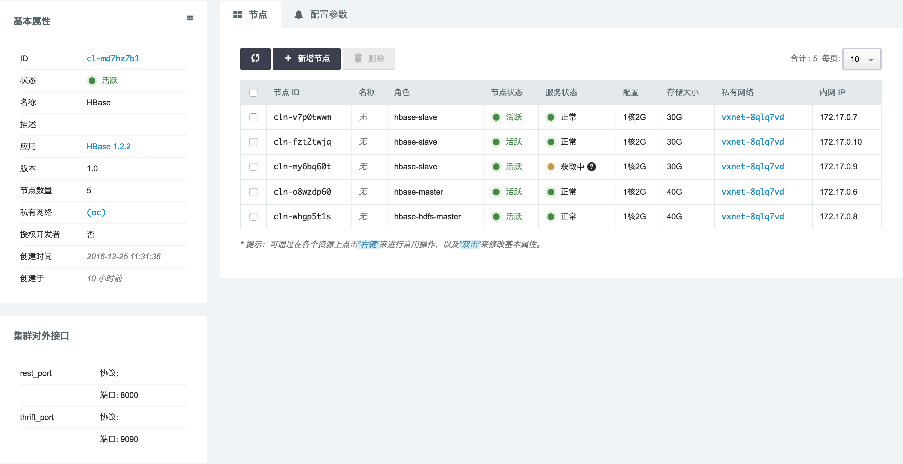

# 测试应用版本

输入完版本名称、配置文件以及版本描述之后可以点击“保存”按钮更新版本所有信息。提交审核之前需要对此版本进行完善测试，点击版本编辑表单最下方的“去控制台测试”按钮，可以前往控制台实际部署集群实例并进行各方面测试。值得注意的是测试区必须是您应用镜像所在区，只有当发布以后镜像才会复制到其它区。

在测试部署集群实例时需要填写创建表单，提交之后便开始部署过程，部署完成之后可在“集群列表”页面看到刚刚创建的集群实例，进入其详情页面可以查看到“基本信息”、“节点列表”以及“配置参数”等信息，同时可对集群实例做各项操作以测试其可用性等。

