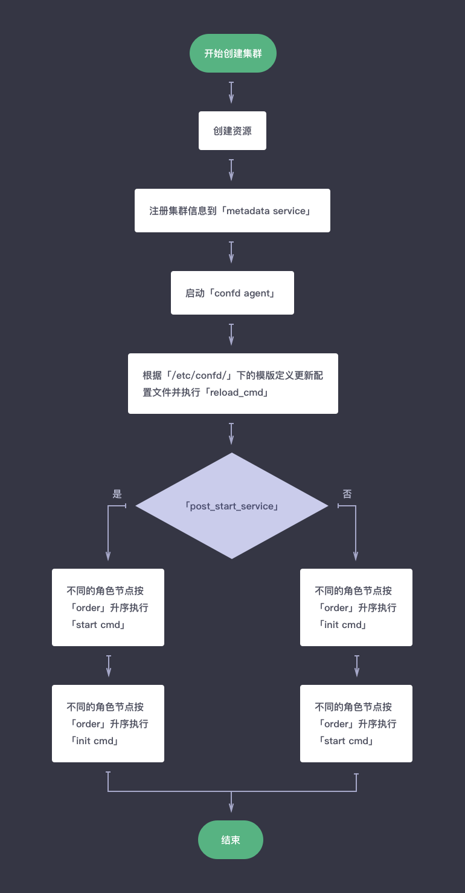
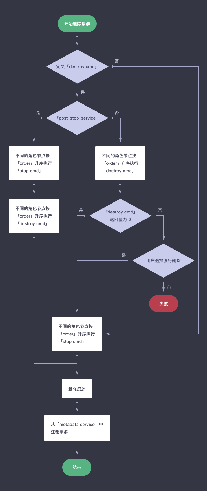
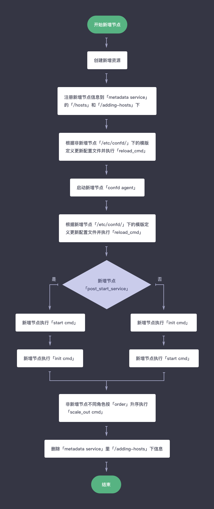
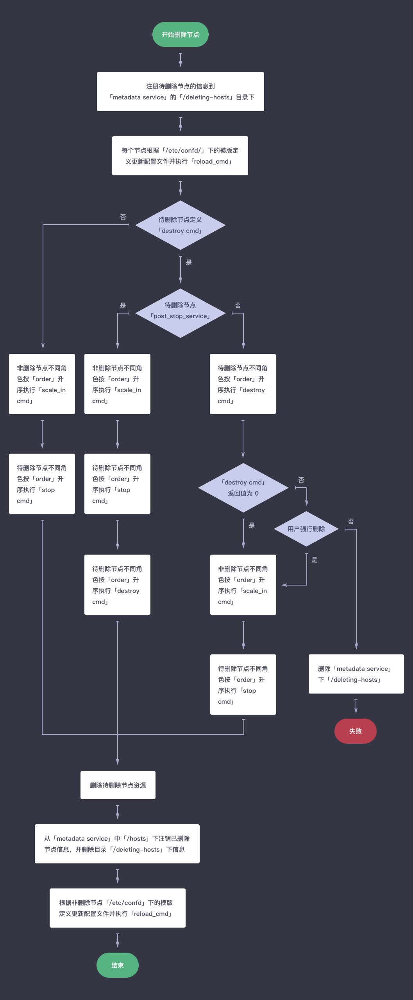
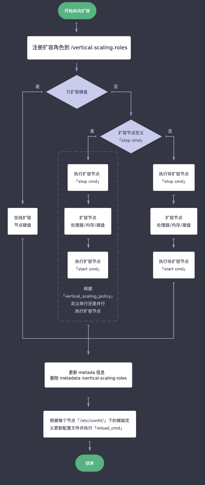

# 应用实例生命周期

此章节列出应用实例即集群几个主要操作的基本流程图，包括创建集群、删除集群、增加节点、删除节点和纵向扩容。

### 创建集群

1. 创建当前集群所有节点的资源如主机、硬盘、IP 地址等；　 
2. 将本集群中所有信息注册到 [metadata service](../metadata-service.md) 中；　 
3. 启动所有节点的 confd agent，监控 metadata service 中本集群信息的变化并按照 /etc/confd 下的模版 (toml、tmpl) 定义刷新配置；如果 toml 文件里定义 reload_cmd　且配置确实发生变更则相应地执行该命令；　 
4. 执行 init 和 start 中定义的 cmd，按照 init 中 [post\_start\_service](specifications.md#post-start-service) 的定义顺序执行，如果 post\_start\_service 为 true 则表示 init 在 start 后执行；不同 role 节点相同命令执行顺序按照 order 的定义从小到大依次执行，默认为0(最早执行)，相同 order 的节点并行执行。

### 删除集群

1. 如果待删除的节点定义了 destroy service，则从第 3 步开始执行；如果没有则执行第 2 步和最后一步；  
2. 不同角色节点按照 order 升序执行 stop cmd； 
3. 如果待删除节点 destroy service 里定义了 post\_stop\_service 为 False，则从第 5 步开始执行；否则执行第 4 步和最后一步； 
4. 待删除的不同角色按照 order 升序执行 stop cmd，然后按照 order 升序执行 destroy cmd； 
5. 待删除的不同角色按照 order 升序执行 destroy cmd；依据返回值正常 (0) 或非正常 (非０) 决定下一步，此处如此设置是提供一种保护措施，您可以在 destroy 命令里查看能否删除该节点或集群，以预防数据丢失； 
6. 如果 destroy cmd 返回非正常且用户不选择强行删除，则此任务失败且终止；  
7. 如果 destroy cmd 返回正常或者在不正常情况下用户选择强行删除，则不同角色节点按照 order 升序执行 stop cmd； 
8. 删除当前集群所有资源，并且将本集群中所有信息从 metadata service 中注销。

### 增加节点

> 新增角色节点需支持横向伸缩，即定义了 scale\_horizontal 的 advanced\_actions，参见 [应用开发模版规范-完整版](specifications/specifications.md)。  

1. 创建新增节点的资源如主机、硬盘、IP 地址等； 
2. 注册新增节点的信息到 metadata service 中即 /hosts 下，同时注册到 /adding-hosts 这个临时目录下 (注：应用的主机可以从这个临时目录获取信息并执行横向扩容之前预处理操作等)； 
3. 由于 metadata service 中集群信息发生改变，因此非新增节点可能会同时更新配置。如果 toml 文件里定义 reload_cmd 且配置确实发生变更则执行该命令； 
4. 启动新增节点的 confd agent，同时更新自身配置信息并执行 reload_cmd；　 
5. 执行新增节点 init 和 start 中定义的 cmd，按照 init 中 post\_start\_service 的定义顺序执行，不同角色节点相同命令执行顺序按照 order 的定义从小到大依次执行，默认为0(最早执行)，相同 order 的节点并行执行；　 
5. 执行非新增节点(即集群中除新增节点外其它节点，通过nodes_to_execute_on指定在某几个节点上执行) scale\_out 中定义的 cmd；　 
6. 删除 metadata service 中 /adding-hosts 这个临时目录下的内容。

### 删除节点

> 待删除角色节点需支持横向伸缩，即定义了 scale\_horizontal 的 advanced\_actions。  

1. 注册待删除节点的信息到 metadata service 的 /deleting-hosts 这个临时目录下。　 
2. 由于 metadata service 中集群信息发生改变，因此所有节点可能会同时更新配置。如果 toml 文件里定义 reload_cmd 且配置确实发生变更则执行该命令； 
3. 待删除节点定义了 destroy service 则从第 ５ 步开始执行操作，否则执行第 4 步和最后三步； 
4. 非删除节点不同角色按照 order 升序执行 scale_in cmd，然后待删除节点不同角色按照 order 升序执行 stop_cmd； 
5. 如果待删除节点 destroy service 里定义了 post\_stop\_service 为 False，则从第 7 步开始执行；否则执行第 6 步和最后三步； 
6. 非删除节点不同角色按照 order 升序执行scale_in cmd；然后待删除节点不同角色按照 order 升序执行 stop cmd，然后按照 order 升序执行 destroy cmd； 
7. 待删除的不同角色按照 order 升序执行 destroy cmd；依据返回值正常 (0) 或非正常 (非０) 决定下一步，此处如此设置是提供一种保护措施，您可以在 destroy 命令里查看能否删除该节点，以预防数据丢失； 
8. 如果 destroy cmd 返回非正常且用户不选择强行删除，则此任务失败且终止，同时删除 metadata service 临时目录 /deleting-hosts 下信息；  
9. 如果 destroy cmd 返回正常或者在不正常情况下用户选择强行删除，则不同角色节点按照 order 升序执行 scale_in cmd，然后个节点按 order 升序执行 stop cmd； 
10. 删除集群中这些节点资源； 
11. 将删除了的节点信息从 metadata service 中注销并且删除临时目录 /deleting-hosts 下信息；　 
12. 由于 metadata service 中集群信息发生改变，因此剩余所有节点可能会同时更新配置。如果 toml 文件里定义 reload_cmd 且配置确实发生变更则执行该命令。

### 纵向扩容

1. 注册扩容角色到 vertical-scaling-roles
2. 如果只扩容硬盘则直接并行执行在线扩容，然后执行最后两步； 
4. 如果待扩容节点定义了 stop service，则执行第 3 步和最后两步；否则执行第 4 步和最后两步； 
4. 按照 vertical_scaling_policy 的定义顺序执行 (sequential) 或 并行执行 (parallel) 以下操作：执行待扩容节点 stop cmd；扩容节点；执行扩容节点 start cmd； 
5. 执行非扩容节点的 stop cmd；然后扩容节点；最后执行非扩容节点 start cmd； 
6. 更新扩容节点的信息到 metadata service 中，并删除 vertical-scaling-roles；　 
7. 由于 metadata service 中集群信息发生改变，因此所有节点可能会同时更新配置。如果 toml 文件里定义 reload_cmd 且配置确实发生变更则执行该命令。
注： 如果扩容过程中发生异常， vertical-scaling-roles 也会被删除