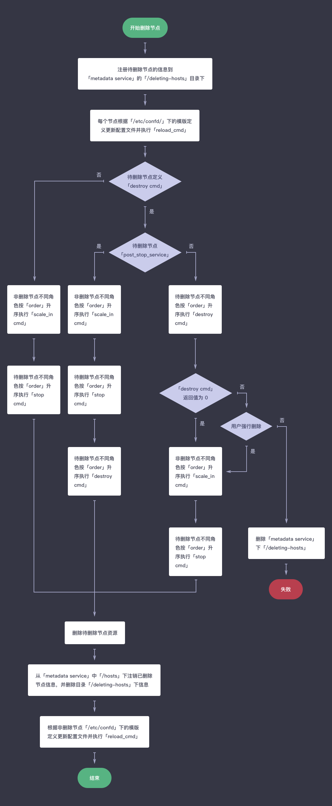
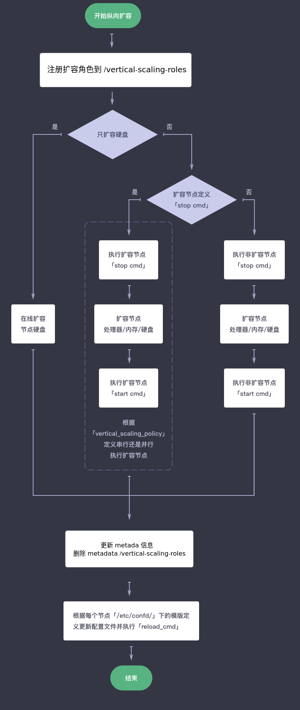

# Lifecycle of Application Instance

This Section demostrate some typical flow diagram for application instance, including: creating/deleting cluster, adding/deleting node, and horizontal scaling.  

## Create cluster

1. Prepare resources for this cluster, including instance, volume, network...etc.  
2. Register cluster into to [metadata service](../metadata-service.md).  
3. Start confd agent on all nodes, which will monitor metadata service, update the corresonding files which are defined in the template files(toml&tmpl) under /etc/confd if any cluster info is changed. If reload_cmd is defined in toml file and related meta data is changed, corresponding reload command will be executed.  
4. Execute the command defined in init and start service according to the order defined in init service [post\_start\_service](specifications.md#post-start-service), init command will execute after start command if post\_start\_service is set to true. The same service command on the nodes with different roles should execute in order by 'order' property defined in mustache file, the smaller value of 'order' is set, the higher priority the command is assigned with. The default value of 'order' property is zero, which means all nodes execute same service command together.  

## Delete cluster

1. If destroy service command is defined for the node to be deleted, implement the logic in step 3 below, otherwise implement step 2 and 8.  
2. For all nodes, execute stop command based on the value of 'order' property in ascending order.  
3. If post\_stop\_service of destroy service is set to False for the node to be deleted, implement the logic in step 5 below, otherwise implement step 4 and 8.  
4. For all nodes, execute stop command based on the value of 'order' property in ascending order， then execute destroy command in same way.  
5. For all nodes, execute destroy command based on the value of 'order' property in ascending order, move to corresponding step according to the exit code as success(zero) or failure(non zero). Designing the logic as this is to pretent to losing data from deleting nodes/cluster.  
6. Stop deleting nodes/cluster if destroy command return non zero result and 'Force Delete' option is not selected, terminate this 'Deleting' task as failure.  
7. If destroy command return zero result and 'Force Delete' option is selected regardless of return result, execute stop command based on the value of 'order' property in ascending order.  
8. Delete all resources of this cluster and cluster infomation from metadata service.  

## Add node

> To support adding node for node of specified role, please define scale\_horizontal in advanced\_actions, refer to [Development Specification - Full Version](specifications/specifications.md)  

1. Prepare resources for this new node, including instance, volume, network...etc.
2. Register node into to metadata service, stored under /hosts, also store this data under /adding-hosts, which is temporary folder for some pre-processing options for horizontal scalling  
3. 由于 metadata service 中集群信息发生改变，因此非新增节点可能会同时更新配置。如果 toml 文件里定义 reload_cmd 且配置确实发生变更则执行该命令； 
4. 启动新增节点的 confd agent，同时更新自身配置信息并执行 reload_cmd
5. 执行新增节点 init 和 start 中定义的 cmd，按照 init 中 post\_start\_service 的定义顺序执行，不同角色节点相同命令执行顺序按照 order 的定义从小到大依次执行，默认为0(最早执行)，相同 order 的节点并行执行
5. 执行非新增节点(即集群中除新增节点外其它节点，通过nodes_to_execute_on指定在某几个节点上执行) scale\_out 中定义的 cmd
6. 删除 metadata service 中 /adding-hosts 这个临时目录下的内容。

## 删除节点

> 待删除角色节点需支持横向伸缩，即定义了 scale\_horizontal 的 advanced\_actions。  

1. 注册待删除节点的信息到 metadata service 的 /deleting-hosts 这个临时目录下。　 
2. 由于 metadata service 中集群信息发生改变，因此所有节点可能会同时更新配置。如果 toml 文件里定义 reload_cmd 且配置确实发生变更则执行该命令； 
3. 待删除节点定义了 destroy service 则从第 ５ 步开始执行操作，否则执行第 4 步和最后三步； 
4. 非删除节点不同角色按照 order 升序执行 scale_in cmd，然后待删除节点不同角色按照 order 升序执行 stop_cmd； 
5. 如果待删除节点 destroy service 里定义了 post\_stop\_service 为 False，则从第 7 步开始执行；否则执行第 6 步和最后三步； 
6. 非删除节点不同角色按照 order 升序执行scale_in cmd；然后待删除节点不同角色按照 order 升序执行 stop cmd，然后按照 order 升序执行 destroy cmd； 
7. 待删除的不同角色按照 order 升序执行 destroy cmd；依据返回值正常 (0) 或非正常 (非０) 决定下一步，此处如此设置是提供一种保护措施，您可以在 destroy 命令里查看能否删除该节点，以预防数据丢失； 
8. 如果 destroy cmd 返回非正常且用户不选择强行删除，则此任务失败且终止，同时删除 metadata service 临时目录 /deleting-hosts 下信息；  
9. 如果 destroy cmd 返回正常或者在不正常情况下用户选择强行删除，则不同角色节点按照 order 升序执行 scale_in cmd，然后个节点按 order 升序执行 stop cmd； 
10. 删除集群中这些节点资源； 
11. 将删除了的节点信息从 metadata service 中注销并且删除临时目录 /deleting-hosts 下信息
12. 由于 metadata service 中集群信息发生改变，因此剩余所有节点可能会同时更新配置。如果 toml 文件里定义 reload_cmd 且配置确实发生变更则执行该命令。

## 纵向扩容

1. 注册扩容角色到 vertical-scaling-roles
2. 如果只扩容硬盘则直接并行执行在线扩容，然后执行最后两步； 
4. 如果待扩容节点定义了 stop service，则执行第 3 步和最后两步；否则执行第 4 步和最后两步； 
4. 按照 vertical_scaling_policy 的定义顺序执行 (sequential) 或 并行执行 (parallel) 以下操作：执行待扩容节点 stop cmd；扩容节点；执行扩容节点 start cmd； 
5. 执行非扩容节点的 stop cmd；然后扩容节点；最后执行非扩容节点 start cmd； 
6. 更新扩容节点的信息到 metadata service 中，并删除 vertical-scaling-roles
7. 由于 metadata service 中集群信息发生改变，因此所有节点可能会同时更新配置。如果 toml 文件里定义 reload_cmd 且配置确实发生变更则执行该命令。

> 注： 如果扩容过程中发生异常， vertical-scaling-roles 也会被删除
